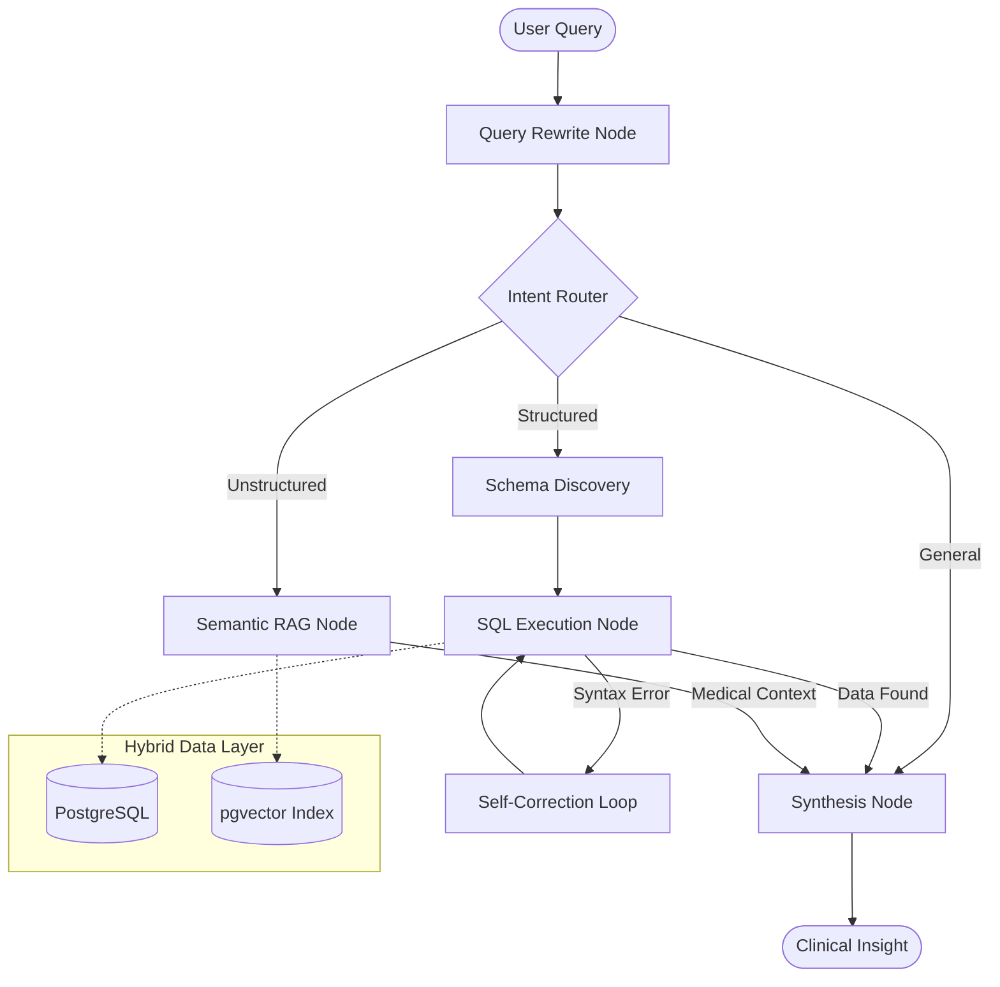

# CLINICAL DATA INTELLIGENCE SYSTEM

<br>

*The Clinical Data Intelligence System is a professional AI platform designed to make clinical information easy to access through simple, natural conversation. It enables doctors and healthcare staff to instantly search patient records, medical notes, and lab results without needing technical database skills. By seamlessly integrating structured database records with unstructured clinical notes, the system automates manual reporting and provides clear insights that help medical teams save time and provide better care for their patients.*


<br>

<div align="center">
  
</div>

<br>

## Case Study: Solving Clinical Data Fragmentation

> ⭐ **SITUATION:** Clinical environments suffer from fragmented data. Quantitative metrics (billing/labs) live in rigid SQL databases, while qualitative insights (clinical notes) are locked in unstructured text. Clinicians lose hours waiting for manual data pulls, delaying patient care and operational decisions.
>
> ⭐ **TARGET:** The mission was to build a "Clinical Intelligence Layer" that translates natural language into precise database queries.
>
> ⭐ **ACTION:** Engineered a deterministic state machine using **LangGraph** to orchestrate a hybrid retrieval system. Implemented a **Semantically Augmented Data Dictionary** to bridge clinical logic with SQL schemas, integrated **pgvector** for narrative medical searches, and built a **Proactive Discovery & Self-Healing loop** that autonomously corrects database hallucinations in real-time.
>
> ⭐ **RESULT:** Reduced data-pull latency from days to **sub-second execution** with near-100% precision. Built a *Reasoning Trace* UI that exposes the agent's internal logic, building critical trust with medical professionals.

<br>

## Core Capabilities

| Feature | Clinical Benefit |
| :--- | :--- |
| **Self-Healing SQL** | Eliminates manual query fixes by autonomously correcting syntax errors. |
| **Proactive Discovery** | Prevents hallucinations by fetching real categorical values before writing SQL. |
| **Hybrid Retrieval** | Combines exact lab results with semantic insights from clinical notes. |
| **Contextual Rewrite** | Maintains diagnostic accuracy in multi-turn conversations by resolving pronouns. |

<br>

## Technical Architecture

The system is built on a modular, state-managed architecture designed for high availability and clinical precision.

     




#### System Stack Overview

| Layer | Component / Tech | Key Responsibility |
| :--- | :--- | :--- |
| **Orchestration** | **LangGraph** | Managing state-based clinical reasoning and tool loops. |
| **Knowledge Layer** | **Data Dictionary** | Mapping natural language to complex clinical business logic. |
| **API Backend** | **FastAPI** | Providing high-concurrency, sub-second response times. |
| **Knowledge Base** | **pgvector** | Storing medical narratives and protocol embeddings. |
| **Modern UI** | **React 19** | Delivering a transparent "Reasoning Trace" for clinician trust. |

<br>

## Engineering Deep Dive: Challenges & Solutions

✴️ Challenge: Managing Non-Linear Clinical Logic → Solution: State-Machine Orchestration  
At its core, the system utilizes a **LangGraph-driven State Graph** to manage complex reasoning. Unlike basic linear chains, this architecture allows for **directed cycles**, enabling the agent to revisit previous steps if conditions aren't met. This state-managed approach allows the system to generate a **Reasoning Trace**, exposing its internal "Chain of Thought" to clinicians for verification before final synthesis.

✴️ Challenge: Conversational Context Drift → Solution: Recursive Query Transformation  
To support natural, multi-turn dialogue, the system implements an intelligent **Query Rewrite Node**. This node uses LLM-based transformation to turn ambiguous follow-up questions (e.g., *"What about his labs?"*) into standalone, context-rich queries (*"Show laboratory results for Patient X"*). This prevents "memory contamination" and ensures the intent router always receives a clear, precise instruction.

✴️ Challenge: Fragmented Patient Histories → Solution: Multi-Modal Data Fusion (SQL + RAG)  
To provide a 360-degree patient view, the system implements a **multi-modal retrieval strategy**. It simultaneously pulls quantitative data (billing, labs) via exact-match SQL and qualitative narratives (symptoms, history) via semantic search. By utilizing the **BGE-M3** embedding model and **pgvector**, the system captures subtle medical nuances that traditional keyword search would miss.

✴️ Challenge: SQL Hallucination & Syntactic Errors → Solution: Proactive Discovery & Self-Correction  
To guarantee precision, the system employs **Proactive Schema Discovery** guided by a **Semantically Augmented Data Dictionary.** Before generating SQL, the agent consults a custom knowledge map that defines complex clinical relationships and business rules (e.g., precise age-calculation logic). It then fetches real-time categorical values from the database to ensure the query is perfectly grounded in live data. If a query fails, an autonomous **Self-Correction Loop** captures the database error and feeds it back to the agent for an immediate, self-healing rewrite.

<br>

## Technical Rationale: Why This Stack?

*   **LangGraph over LangChain**: Unlike standard chains, LangGraph provides the fine-grained control over **cycles and state** required for a non-linear clinical diagnostic flow.
*   **PostgreSQL + pgvector over Pinecone**: By using pgvector, the system can perform complex SQL joins and semantic vector searches within a **single transaction**, ensuring data consistency between structured records and clinical notes.
*   **FastAPI over Django**: Chosen for its high-performance asynchronous capabilities, enabling the sub-second response times critical for real-time medical consultation environments.

<br>

## Trust & Transparency

*   **Reasoning Trace**: The system exposes its internal "Chain of Thought" to the user, allowing clinicians to verify the logic behind every data retrieval and synthesis.
*   **Audit Accountability**: Every interaction is logged with precise tool usage and raw query data (via `AuditLog`), ensuring a transparent audit trail for all clinical intelligence activities.
*   **Deterministic Guardrails**: Using LangGraph, the system enforces a strict state-managed flow, preventing the AI from wandering into "creative" or ungrounded responses.

<br>

## Installation & Setup

### 1. Backend Configuration
```bash
# Clone the repository
git clone https://github.com/suranjitpartho/clinical-data-intelligence-system.git
cd clinical-data-intelligence-system

# Environment Setup
python -m venv venv
source venv/bin/activate  # On Windows use `venv\Scripts\activate`
pip install -r requirements.txt

# Database & AI Initialization
cp .env.example .env
alembic upgrade head
python scripts/seed_data.py
python scripts/generate_embeddings.py  # Critical: Generates vector vectors for RAG

# Launch API
uvicorn app.main:app --reload --port 8000
```

### 2. Frontend Configuration
```bash
cd frontend
npm install
npm run dev
```

