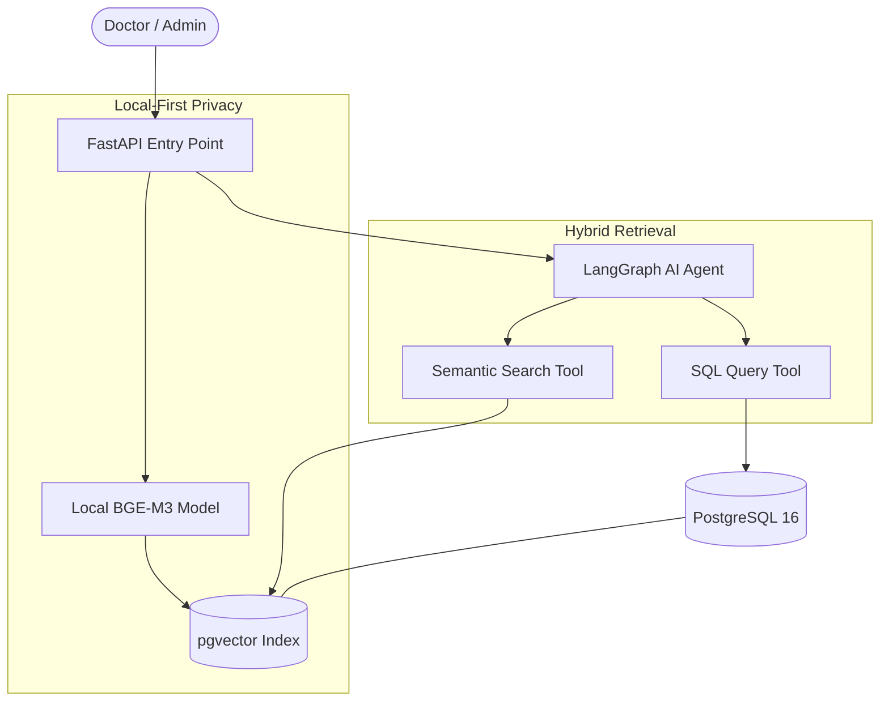

# 🏥 Clinical Data Intelligence System (CDIS)


## 🌟 Overview
The **Clinical Data Intelligence System (CDIS)** is a next-generation AI-powered backend designed for healthcare providers. It solves the "Unstructured Data Problem" in clinical environments by combining traditional relational record-keeping with advanced **Semantic Search** and **AI Agent orchestration**.

### 💡 The Problem
In modern clinics, over 80% of patient data exists in unstructured "Clinical Notes." Traditional systems cannot query this data efficiently. Doctors struggle to find historical patterns in patients' notes, leading to delayed diagnoses and cognitive load.

### 🚀 The Solution
CDIS utilizes a **Hybrid Retrieval-Augmented Generation (RAG)** architecture. It allows administrators to query structured data (billing, staff, inventory) via SQL and enables doctors to perform semantic search across millions of words of clinical notes using AI vectors—all while maintaining a **Privacy-First** local-first architecture.

---

## 🛠 Tech Stack
*   **Backend:** FastAPI (Python) - High performance, asynchronous.
*   **Database:** PostgreSQL 16 + `pgvector` for vector similarity search.
*   **ORM:** SQLAlchemy 2.0 with Alembic for migrations.
*   **Local AI (Embeddings):** `BAAI/bge-m3` running locally on Apple Silicon (M5).
*   **AI Orchestration:** LangGraph (AI Agentic workflows).
*   **Compliance:** Designed with NZ Health Information Security (HISO) principles.

---

## 🏗 System Architecture


---

## 🔑 Key Features
*   **Semantic Note Retrieval:** Find "patients with respiratory signs who didn't respond to antibiotics" using meaning, not just keywords.
*   **Agentic Workflows:** The AI agent automatically decides whether a user query needs a data table (SQL) or a note summary (RAG).
*   **High Volume Seeding:** Pre-configured with **5,000+** realistic clinical records and appointments.
*   **Enterprise-Ready:** UUID-based primary keys, comprehensive `audit_logs` for compliance, and automated DB migrations.

---

## 📈 Future Production Roadmap
Currently, the system uses **Local Embedding Models** for maximum privacy. For enterprise production, the architecture is ready to scale to:
1.  **Cloud Embeddings:** Integration with OpenAI (text-embedding-3-small) or Voyage AI.
2.  **Distributed Task Queues:** Moving embedding generation to Celery/Redis for real-time note processing.
3.  **FHIR Integration:** Full support for Fast Healthcare Interoperability Resources data standards.

---

## 🔧 Setup & Installation
1.  **Clone & Venv:**
    ```bash
    python3 -m venv venv
    source venv/bin/activate
    pip install -r requirements.txt
    ```
2.  **Database Configuration:**
    Ensure PostgreSQL 16 is running with `pgvector` installed. Configure `.env` with your variables.
3.  **Run Migrations & Seed:**
    ```bash
    alembic upgrade head
    PYTHONPATH=. venv/bin/python scripts/seed_data.py
    ```
4.  **Local AI Processing:**
    ```bash
    PYTHONPATH=. venv/bin/python scripts/generate_embeddings.py
    ```

---

## 📄 Documentation
Detailed technical and business documentation can be found in the `/docs` folder:
*   [Architectural Decision Records (ADR)](docs/ARCHITECTURAL_DECISIONS.md)
*   [Data Privacy & Compliance (NZ)](docs/DATA_PRIVACY_REPORT.md)
