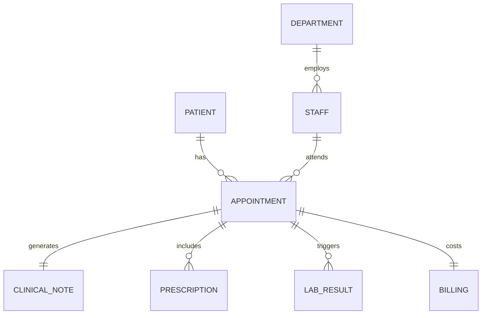

# Clinical Database Schema (Standardized)

This system uses a normalized PostgreSQL 16 schema designed for high-integrity clinical transactions and high-speed semantic search.

## Overview
All entities use **UUID v4** as primary keys to ensure data sovereignty and non-predictable reference points.

## 1. Core Clinical Entities

### `patients`
Stores demographic and contact information.
*   **Key Security:** `nhi_number` (National Health Index) is indexed and required to be unique.
*   **Fields:** `id`, `nhi_number`, `first_name`, `last_name`, `dob`, `gender`, `email`, `phone`, `address`.

### `staff`
Records medical professionals and administrative personnel.
*   **Relationships:** Belongs to a `department`.
*   **Fields:** `id`, `first_name`, `last_name`, `role` (Doctor, Nurse, Admin), `specialisation`.

### `appointments`
The junction table linking Patients, Doctors, and Departments.
*   **Fields:** `id`, `patient_id`, `doctor_id`, `department_id`, `appointment_date`, `status`, `reason`.

## 2. Clinical Records & Intelligence

### `clinical_notes` (RAG Target)
The most critical table for AI Intelligence. Stores qualitative doctor observations.
*   **Intelligence:** Contains a `vector` column (1024-dim) for semantic search via `pgvector`.
*   **Fields:** `id`, `appointment_id`, `content`, `vector`.

### `prescriptions` & `lab_results`
Structured medical outputs generated during or after an appointment.
*   **Fields:** `medication`, `dosage`, `frequency` (Prescriptions); `test_name`, `result_value`, `is_abnormal` (Lab Results).

## 3. Operations & Audit

### `billing`
Financial records linked to clinical appointments.
*   **Fields:** `id`, `appointment_id`, `amount`, `status` (Paid, Pending).

### `audit_logs` (AI Compliance)
Tracks every decision made by the AI Agent.
*   **Fields:** `id`, `timestamp`, `user_query`, `tool_used` (SQL vs RAG), `result_summary`.

## Relationship Diagram (Conceptual)

