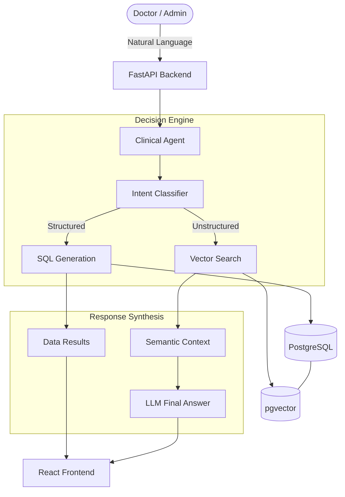

# Clinical Data Intelligence System (CDIS) - Deep Project Overview

The **Clinical Data Intelligence System (CDIS)** is a sophisticated AI-powered ERP designed for **ClearPath Medical Centre**, a fictional New Zealand-based private clinic. It addresses the "Unstructured Data Problem" in healthcare by merging traditional relational data management with modern Semantic Search and AI agentic workflows.

## 🏗️ Core Architecture
The system follows a **Hybrid Intelligence** model, where a central AI agent intelligently routes user queries to the most appropriate tool:

1.  **SQL Engine:** For structured queries (e.g., revenue reports, appointment counts, inventory levels).
2.  **RAG (Retrieval-Augmented Generation) Engine:** For unstructured queries (e.g., searching medical history, finding symptom patterns in clinical notes).

## 🛠️ Technology Stack
| Layer | Technology | Rationale |
| :--- | :--- | :--- |
| **Frontend** | React + Vite + Tailwind | Modern, responsive chat UI with data visualization support. |
| **Backend** | FastAPI | Asynchronous performance for handling AI inference and DB I/O. |
| **Database** | PostgreSQL + `pgvector` | Industry-standard relational DB extended for native vector search. |
| **AI Inference** | Apple MLX (Llama-3 8B) | Privacy-first, local-first inference optimized for Apple Silicon. |
| **AI Agent** | LangGraph (Simplified) | Orchestrates the tool selection and self-correction loops. |
| **Data Control** | Semantic Data Dictionary | A JSON-based schema map that teaches the AI how to query the DB safely. |

## 📁 Key Components & Files
*   **[`app/services/agent.py`](file:///Users/suranjitdas/Projects/ai-projects/clinical-data-intelligence/app/services/agent.py):** The "brain" that classifies intent and executes either SQL or RAG workflows.
*   **[`app/services/data_dictionary.json`](file:///Users/suranjitdas/Projects/ai-projects/clinical-data-intelligence/app/services/data_dictionary.json):** Human-readable descriptions of every table and column, used by the LLM to generate precise SQL.
*   **[`scripts/seed_data.py`](file:///Users/suranjitdas/Projects/ai-projects/clinical-data-intelligence/scripts/seed_data.py):** Generates 5,000+ realistic clinical records using NZ-locale data (NHI numbers, local addresses).
*   **[`frontend/src/App.jsx`](file:///Users/suranjitdas/Projects/ai-projects/clinical-data-intelligence/frontend/src/App.jsx):** The chat interface that renders reasoning traces, tool status, and dynamic data tables.

## 🌟 Unique Selling Points (Portfolio Highlights)
*   **Privacy-First:** Clinical notes never leave the local machine; embeddings and inference run natively on Apple Silicon.
*   **Self-Correction:** The agent can detect if a generated SQL query failed and attempt to fix it before responding.
*   **Deep NZ Context:** Uses New Zealand Health Information Security (HISO) principles and local data standards like NHI.
*   **Hybrid Retrieval:** Seamlessly switches between counting dollars (SQL) and understanding symptoms (RAG).

## 🚀 Current Milestone
The system now supports **native DATE-based age calculations** in PostgreSQL, following a schema migration from VARCHAR to DATE for the `patients.date_of_birth` column.
